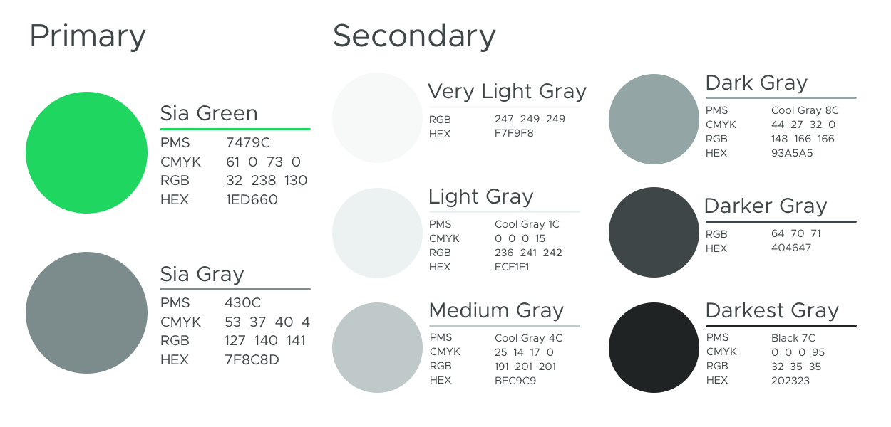

# Brand Guidelines

Third-party projects constitute an integral part of the Sia ecosystem as they broaden the range of applications of Sia and enhance the network through solutions that are not actively being developed by our team.

We aim for users to discern between core and non-core projects for several reasons:

* Non-core projects often involve some level of centralization, which is entirely acceptable. Users benefit from having choices, and centralization allows for the implementation of features that are more accessible to achieve compared to those on Sia's core infrastructure.
* There's a potential for confusion where users might mistake your project for something created by the core team. Therefore, we want to ensure that users know where to seek assistance.
* Acknowledge your dedication to your project; we desire to give it the recognition it deserves, allowing it to stand out prominently.

## Guidelines

These Sia brand guidelines will assist those developing their project by ensuring clarity, consistency, and distinction between other projects and core Sia offerings, ultimately fostering user trust and recognition.

### Official Sia assets

The official Sia assets, including our logo and wordmark in various high-quality formats, can be downloaded [here](https://sia.tech/assets/official-sia-assets.zip).


We strongly recommend using any of the `built-with-sia` logo variations to showcase your integration. This logo is a badge of association with Sia, so feel free to incorporate it anywhere necessary to your project.


### Logo and Wordmark

The Sia Foundation strictly owns the trademark in the US and advises against using the Sia logo and wordmark directly in any capacity, such as projects. Users can only style the original logo and wordmark to prevent confusion and misrepresentation.&#x20;

<figure><figcaption>
Original Sia Logo and wordmark
</figcaption></figure>

 

<figure><figcaption>
Example of styling of the original (Siastats logo)
</figcaption></figure>


The logo can be similar but **must** be differentiated from the original Sia logo and wordmark by color and design.&#x20;


### Naming

Sia's trademark name is pronounced _"sigh-uh, "_not _"see-ya."_

Using the **Sia** is accepted upon naming your project; however, with two restrictions:

* Calling your project solely **Sia**.
* Naming your project **Sia** and then appending a term directly related to our business, such as **Cloud**, **Storage**, or **Backup**.

Some examples of this include **SiaStats**, **Siasync**, **SiaWiki**, and **Siamining**. These names provide a clear indication that the focus is on **Sia**.

You also have the option to craft a uniquely personalized name that reflects your identity or your creative efforts. Illustrative instances of such custom names include **Pixeldrain**, **Filebase**, and **Roadie**.

### Color

Sia incorporates a variety of colors. When crafting your logo, please choose from our color palette or develop one that suits your vision.

Using the exact Sia logo or wordmark to represent your integration with Sia is accepted, but **must** remain the same colors.


We prohibit using the Sia logo or wordmark and changing the color to represent your logo.



We're eagerly anticipating what you'll create! If you have any uncertainties regarding our Sia branding guidelines, please don't hesitate to reach out via our Discord. Make sure to inform us on [Discord](https://sia.tech/discord).

